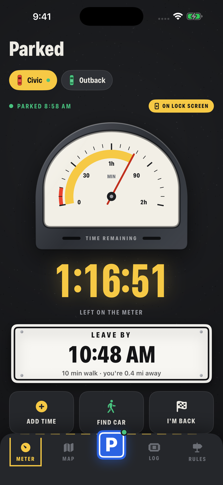
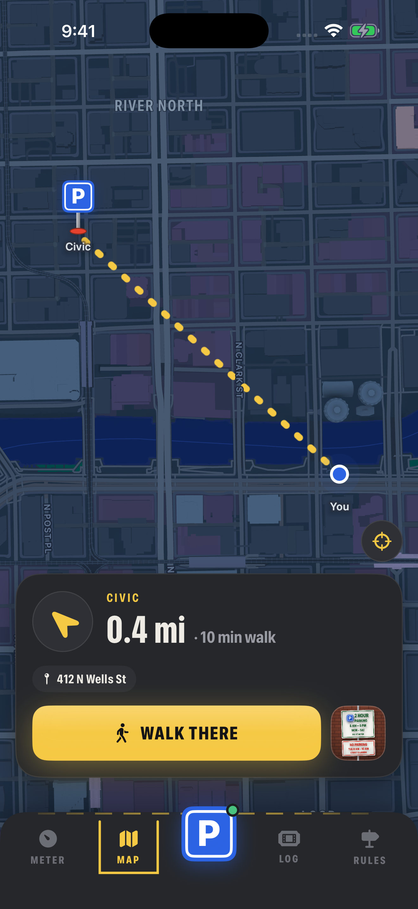
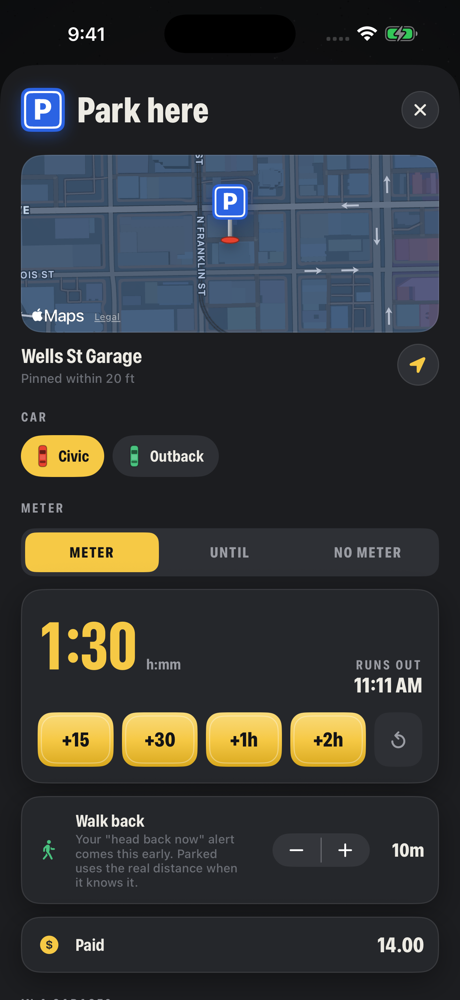

# Parked

Save where you parked, photograph the sign, run the meter, and get told when to head back, allowing for the walk.

  

<p align="center">
  
  
  
</p>

## Features

- A mechanical meter dial that falls toward zero, with a red EXPIRED flag
- "Leave by" time from the meter end minus the real walk back
- Map with distance, walking time, an arrow to the car and Apple Maps hand-off
- Garage level painted on a pillar, a photo of the sign, notes
- Lock Screen / Dynamic Island meter countdown (Live Activity)
- Several cars, a parking log with money spent, saved garages, street-cleaning reminders

## Price

Free download. Parked Pro is a one-time $2.99 in-app purchase. No subscription, no ads.

## Privacy

Location is when-in-use only and stays on the device. Street names come from Apple's system geocoder. Reminders are local notifications. The privacy manifest (`Resources/PrivacyInfo.xcprivacy`) declares no tracking and no collected data types.

## Built without a Mac

This app was written on a Windows PC. No Mac is involved at any point: every build, signature, screenshot and App Store submission runs on GitHub Actions macOS runners, driven by the App Store Connect API.

- **`project.yml`** is an [XcodeGen](https://github.com/yonaskolb/XcodeGen) spec. The `.xcodeproj` is generated on the runner and never committed, so the repo can be edited on any OS and there are no `.pbxproj` merge conflicts.
- **`.github/workflows/build.yml`** runs on every push: picks the newest Xcode 26 and iPhone simulator on the runner, builds, then launches the app once per screen with `-shot <screen>` (sample data, fixed 9:41 status bar) and captures the store screenshots with `simctl`, uploaded as a workflow artifact.
- **`.github/workflows/appstore.yml`** (manual) has three modes: `compile`, `dry_run` (build, sign, upload, do not submit) and `release` (also submits for review). The distribution certificate is imported from a secret into a throwaway keychain; [fastlane](https://fastlane.tools) (`fastlane/Fastfile`) fetches the App Store profile with the API key, sets the build number one above the latest on TestFlight, archives, and uploads the binary with `fastlane/metadata` and the committed `fastlane/screenshots`.
- **`.github/workflows/review-video.yml`** records the App Review screen recording: the app is launched with `-demoAutoplay` and drives its own real screens.
- **`Store/*.py`** talk to the App Store Connect API directly from Windows (Python, `requests` + `PyJWT`): `asc.py` registers the bundle id and pushes metadata, `listing.py` sets the age rating, review details, price and screenshots, and `signing.py` creates the distribution certificate locally so its private key is never stranded on a disposable runner.

Only one step is manual: Apple's API will not create the app record itself, so that is made once in the App Store Connect web UI.

## Build and run

With a Mac and Xcode 26 (the version CI uses; the app targets iOS 17+):

```bash
brew install xcodegen
xcodegen generate
open Parked.xcodeproj
```

Run the `Parked` scheme on any iPhone simulator. No signing is needed for the simulator; from the command line:

```bash
xcodebuild build -project Parked.xcodeproj -scheme Parked \
  -destination 'platform=iOS Simulator,name=iPhone 16 Pro' CODE_SIGNING_ALLOWED=NO
```

To see it filled with sample data, launch with a screenshot argument, e.g. `xcrun simctl launch booted com.mattbusel.parked -shot meter`.

Without a Mac: fork the repo and push. The Build workflow compiles it on a GitHub macOS runner and attaches the screenshots as an artifact.

Shipping your own build needs these repository secrets: `ASC_KEY_ID`, `ASC_ISSUER_ID`, `ASC_KEY_CONTENT` (base64 of the `.p8`), `DEVELOPMENT_TEAM`, `DIST_CERT_P12`, `DIST_CERT_PASSWORD`, plus your own bundle id in `project.yml` and `fastlane/Fastfile`.

## Code map

All app code is in `Sources/` (SwiftUI, Observation, no third-party dependencies).

| File | What it does |
| --- | --- |
| `App.swift` | entry point, tab bar, `-shot` handling |
| `Model.swift` | pets, schedules, doses, supplies, vaccines, weights, JSON persistence |
| `TodayView.swift` | the dose board and who is ticking |
| `Reminders.swift` | local notifications with Given and Snooze actions |
| `PetsView.swift` / `PetFace.swift` | pets, and drawn faces for pets without a photo |
| `VetView.swift` / `HealthView.swift` | vaccines, visits, weight and notes |
| `PDFs.swift` / `SitterView.swift` | the vet summary and sitter sheet as US Letter PDFs |
| `Editors.swift` | shared editor frame and forms |
| `Theme.swift` | oatmeal and persimmon look |
| `Demo.swift` / `Autopilot.swift` | the three-pet demo household and the App Review recording |

`Store/` holds the App Store Connect scripts, `fastlane/` the lanes, listing text and screenshots, `Resources/` the asset catalog and privacy manifest.

---

**More apps built the same way:** [Chain](https://github.com/Mattbusel/chain), [Ironbook](https://github.com/Mattbusel/ironbook), [Quiver](https://github.com/Mattbusel/quiver), [Race Fuel](https://github.com/Mattbusel/race-fuel), [Minder](https://github.com/Mattbusel/minder), [Baseline Ledger](https://github.com/Mattbusel/baseline-ledger), [Fairway Ledger](https://github.com/Mattbusel/fairway-ledger), [Odometer](https://github.com/Mattbusel/odometer), [Rooms](https://github.com/Mattbusel/rooms), [Clockout](https://github.com/Mattbusel/clockout), [Curve](https://github.com/Mattbusel/curve), [Pricebook](https://github.com/Mattbusel/pricebook), [Chores](https://github.com/Mattbusel/chores), [Pocket Beings](https://github.com/Mattbusel/pocket-beings), [Glyphstorm](https://github.com/Mattbusel/glyphstorm), [Clear the Strait](https://github.com/Mattbusel/clear-the-strait).


## Hire the author

I designed, built and shipped this app myself. **Want one like it for your business?** I build native iOS apps from prototype to App Store launch, fixed price. [Services and pricing](https://mattbusel.github.io/) · [Email](mailto:mattbusel@gmail.com) · [LinkedIn](https://www.linkedin.com/in/matthewbusel/)
